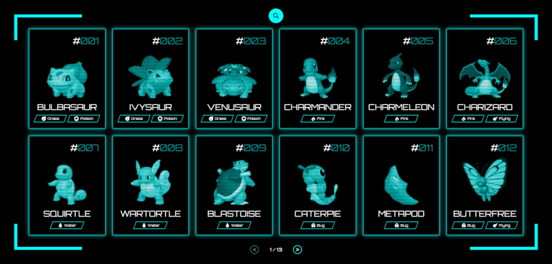

# Pokedex App

A simple and interactive Pokedex web application built with Angular. The Pokedex app allows users to search for Pokémon, view detailed information about each one, including evolutions, stats, and more.

## Features

- Search for Pokémon by name or ID.
- View detailed Pokémon stats, moves, and evolutions.
- Audio player for Pokémon cries.
- Fully responsive design.
- Optimized performance using Angular's zone change detection and routing.

## Demo

Check out the live demo: [Pokedex Live Demo](https://jarvis-dex.netlify.app)

## Documentation

Check out the [Documentation](https://marcel-schmidt-dev.github.io/pokedex)

## Screenshots


_Homepage with a list of Pokémon_


_Detail page of a selected Pokémon with evolution and stats_

## Installation

Follow these instructions to get the project up and running on your local machine.

### Prerequisites

Make sure you have the following installed:

- [Node.js](https://nodejs.org/)
- [Angular CLI](https://angular.io/cli)

### Steps

1. Clone the repository:

   ```bash
   git clone https://github.com/marcel-schmidt-dev/pokedex-app.git
   ```

2. Navigate to the project directory:

   ```bash
   cd pokedex-app
   ```

3. Install dependencies:

   ```bash
   npm install
   ```

4. Run the development server:

   ```bash
   ng serve
   ```

5. Open your browser and navigate to `http://localhost:4200/`.

## Usage

Once the app is running, you can:

- Browse the list of Pokémon on the home page.
- Use the search bar to find specific Pokémon by name or ID.
- Click on a Pokémon to view its details, including stats, moves, and evolutions.
- Play Pokémon cries on the detail page.

## Folder Structure

Here's a brief overview of the project's folder structure:

```bash
src/
│
├── app/
│   ├── components/         # Contains all reusable components like PokemonList, PokemonDetail, etc.
│   ├── services/           # Services for fetching data from the Pokémon API.
│   ├── app.component.ts    # Main component of the application.
│   ├── app.module.ts       # Application module.
│
├── assets/                 # Static assets like images.
├── environments/           # Environment-specific configurations.
├── styles.scss             # Global styles for the application.
└── index.html              # Entry point for the application.
```

## Technologies Used

- **Angular**: Frontend framework.
- **Chart.js**: For displaying Pokémon stats in a radar chart.
- **PokeAPI**: External API used to fetch Pokémon data.
- **SCSS**: Styling the components with modern CSS features.

## Contributing

Contributions are welcome! Here's how you can get involved:

1. Fork the repository.

2. Create a new branch for your feature or bugfix:

   ```bash
   git checkout -b feature/your-feature-name
   ```

3. Make your changes and commit them:

   ```bash
   git commit -m 'Add new feature'
   ```

4. Push your changes to your fork:

   ```bash
   git push origin feature/your-feature-name
   ```

5. Submit a pull request to the main branch of the original repository.

## License

This project is licensed under the MIT License. See the [LICENSE](./LICENSE) file for details.

## Acknowledgements

- Thanks to [PokeAPI](https://pokeapi.co/) for providing the Pokémon data.
- Special thanks to all contributors who have made this project better!

## Contact

If you have any questions or issues, feel free to contact us:

- **Email**: contact@marcel-schmidt.dev
